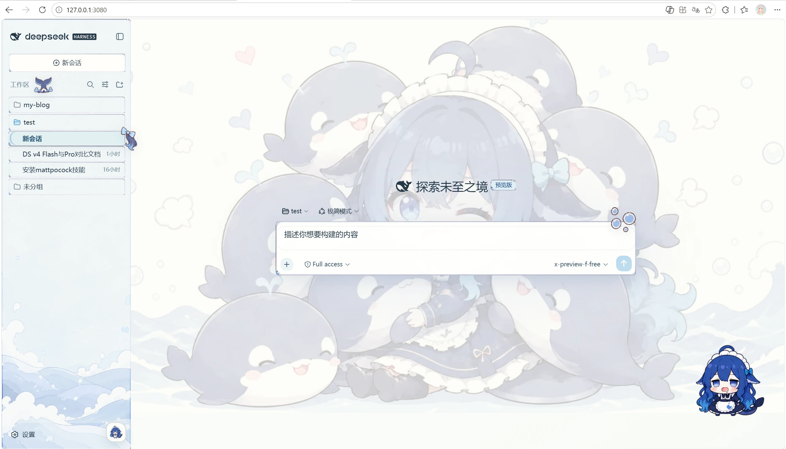
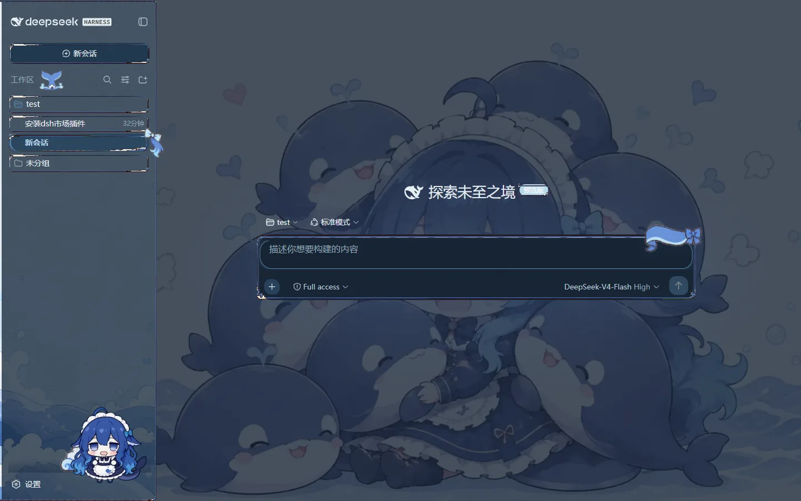

# dsh-maid-whale-webUI

[](https://awesome-dsh-plugin.com)

[English](README.en.md) | 中文

DeepSeek Harness Web UI 的鲸鱼女仆主题插件，包含亮暗模式、海洋插画背景、手绘九宫格边框、装饰素材与常驻 pet。

## 效果预览

| 亮色模式 | 暗色模式 |
|---|---|
| [](maid-whale-webui/preview/light.webp) | [](maid-whale-webui/preview/dark.webp) |

## 安装

### 懒人版

对你的 DSH 说：

```text
安装一下这个皮肤包：https://github.com/yunxiiQwQ/dsh-maid-whale-webUI/tree/main/maid-whale-webui
```

### 手动安装

```powershell
git clone https://github.com/yunxiiQwQ/dsh-maid-whale-webUI.git
cd dsh-maid-whale-webUI
dsh plugin --profile web add ./maid-whale-webui
```

安装后刷新或重启 DeepSeek Harness Web UI。同一时间建议只启用一个界面主题。

## 开发

```powershell
cd maid-whale-webui
pnpm install
pnpm art:embed
pnpm test
pnpm build
```

插件只使用官方 DSH 客户端插件机制，不修改 DeepSeek Harness 源码，也不影响模型请求。

## 许可与声明

代码使用 BSD-3-Clause 许可。本项目是非官方社区主题，素材来源于社区二创，与 DeepSeek 官方无隶属关系。
