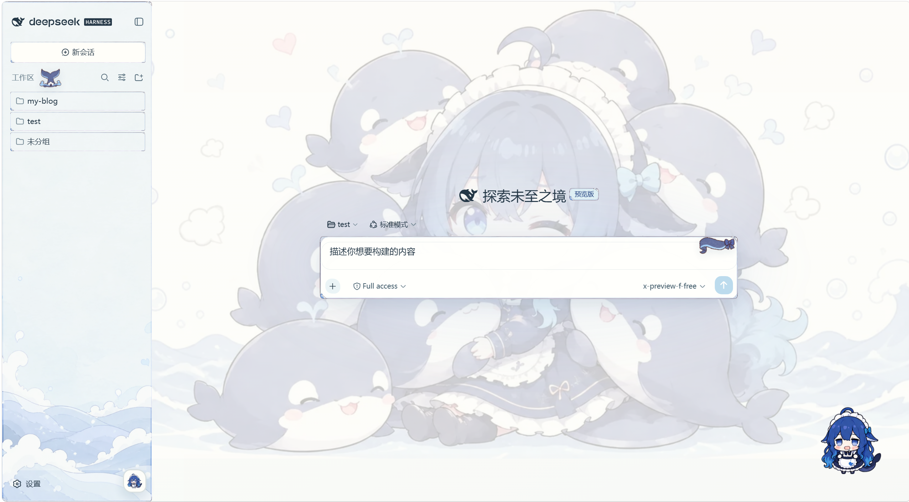
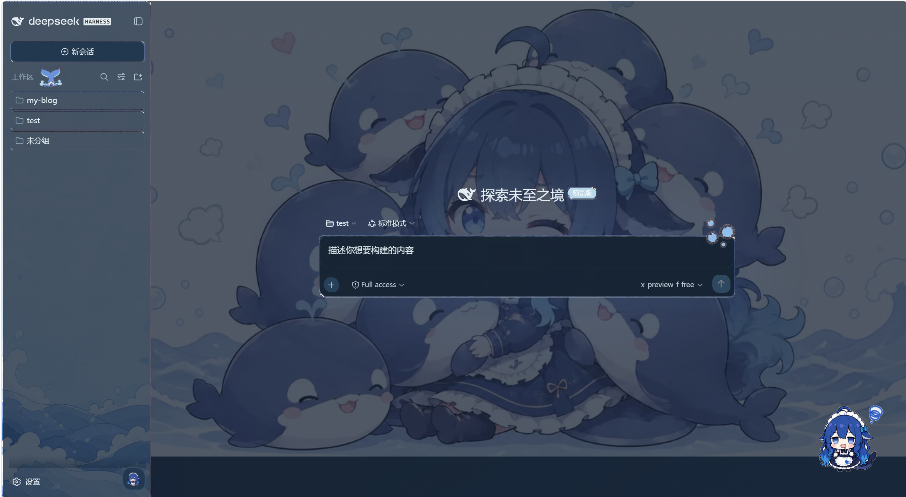
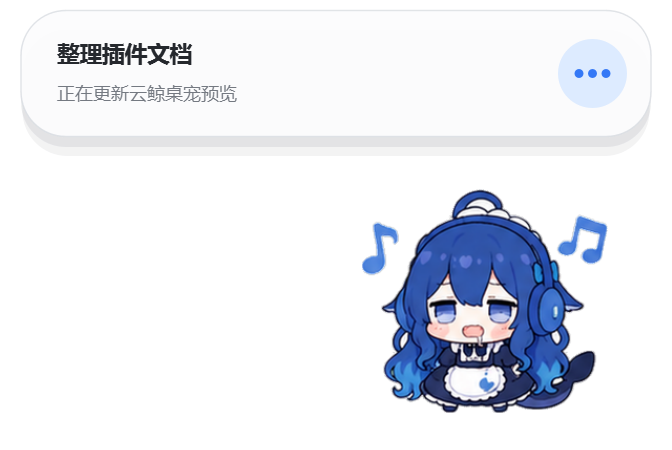

# dsh-maid-whale-webUI

[](https://awesome-dsh-plugin.com)

English | [中文](README.md)

A whale-maid theme plugin for the DeepSeek Harness Web UI, featuring light and dark themes, ocean illustration wallpapers, hand-drawn frames, and a native Windows cloud-whale companion that starts and stops with DSH.

## Theme and Pet Preview

All images below were freshly captured from the current repository version running locally.

| Light mode | Dark mode |
| --- | --- |
| [](preview/theme-light.png) | [](preview/theme-dark.png) |

### Pet Preview

[](preview/pet-working.png)

## Installation

### Requirements

- A working DSH (DeepSeek Harness) Web UI.
- Windows 10/11 x64 for the native companion; the Web UI theme itself is platform-independent.
- No separate Python or Node installation is required: the companion helper is included in the plugin package.

### Ask DSH to install it

Tell DSH:

```text
Install this skin package: https://github.com/yunxiiQwQ/dsh-maid-whale-webUI/tree/main/maid-whale-webui
```

### Manual installation

```powershell
# 1. Fully exit DSH, including the tray process
# 2. Clone the repository and add the plugin
git clone https://github.com/yunxiiQwQ/dsh-maid-whale-webUI.git
cd dsh-maid-whale-webUI
dsh plugin --profile web add ./maid-whale-webui

# 3. Start the DSH Web UI
dsh --profile web
```

The theme applies automatically and the companion appears when DSH starts. If the companion is missing, check **Settings → Plugins → Plugin config → Cloud-whale companion**. The whale button at the bottom-right of the workspace panel also toggles it immediately. Only one UI theme should be enabled at a time.

### Update and uninstall

```powershell
# Update: pull the latest repository changes, then restart DSH
git pull

# Uninstall: fully exit DSH first
dsh plugin --profile web remove @dsh-external/dsh-client-ui-skin-maid-whale-webui
```

## Pet Actions and Triggers

| Action | Trigger |
| --- | --- |
| Idle | DSH is idle with no active session |
| Sleeping | The companion is disconnected from DSH |
| Thinking | A turn starts, the Agent is analysing, or tool results are being reviewed |
| Working | The Agent edits files, uses a general tool, or enters a generic work phase |
| Searching | Search, read, fetch, or open operations |
| Commanding | Shell, terminal, PowerShell, or command execution |
| Testing | Tests, checks, builds, linting, or verification |
| Waiting | The Agent asks a question, requests approval, or becomes blocked |
| Success | Briefly shown when a turn completes normally |
| Error | A tool fails, a turn ends abnormally, or a limit is reached |
| Dragging | The pointer moves beyond the drag threshold while holding the companion |
| Head pat | Click the upper part of the companion, or double-click it |
| Poke | Click the main body area |
| Tail touch | Click the tail area on the right |
| Idle micro-actions | Randomly shown while idle when reduced motion is disabled |

After an interaction ends, the companion returns to the latest Agent state. When several sessions are active, the display priority is: waiting → error → working → thinking → idle.

## Disclaimer

- The code is licensed under BSD-3-Clause.
- This is an unofficial community theme with community fan-created character and illustration assets. It is not affiliated with or endorsed by DeepSeek.
- The Node-side companion code and Python runtime are based on [QCYTSN/dsh-dafeiyu](https://github.com/QCYTSN/dsh-dafeiyu) (MIT). See [`NOTICE`](NOTICE) for full attribution.
- The plugin uses only the official DSH client plugin mechanism. It does not modify the DeepSeek Harness source code or intercept model requests.
- The companion stores no keys, takes no screenshots, sends no telemetry, and opens no extra network ports. It only reacts to DSH events.
